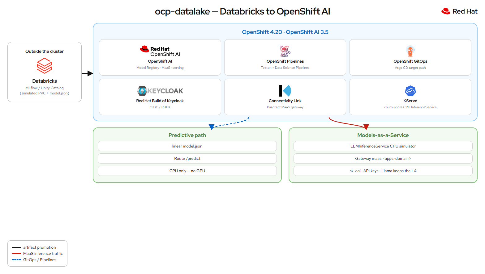
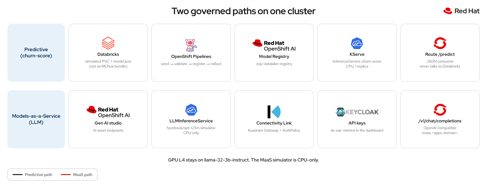

# ocp-datalake

Proof of concept: **promote a versioned model onto OpenShift and serve it under cluster policy**. Data science publishes an artifact; the platform validates it, registers it, and exposes an inference endpoint. The **intended** upstream is Databricks MLflow; this sandbox **simulates** that registry (see [Databricks compatibility](#databricks-compatibility)).

The target cluster is a **single AWS g6.16xlarge node** (64 vCPU, 256 GiB, 1× NVIDIA L4 24 GB). OpenShift is the deployment, identity, and GPU plane.

Namespace: `ocp-datalake`. Licensed under [Apache License 2.0](LICENSE).

**Walkthrough (GitHub Pages):** [maximilianoPizarro.github.io/ocp-datalake](https://maximilianoPizarro.github.io/ocp-datalake/) — interactive demo (Prev / Next / Fullscreen) with live OpenShift and OpenShift AI screenshots. Deploys from `docs/` on push to `main` (Actions → Pages).

Do not commit `oc` tokens, kubeconfigs, or cloud credentials. Rotate any token that was pasted into a chat or a ticket.

---

## Red Hat products

| Product | Role in this flow |
| --- | --- |
| **Red Hat OpenShift** | Cluster, project, Route, SCC, OAuth, RBAC, NetworkPolicy, ResourceQuota |
| **Red Hat OpenShift Data Foundation** (NooBaa) | Target S3 registry (`ObjectBucketClaim`). This sandbox uses a PVC instead. |
| **Red Hat OpenShift Pipelines** (Tekton) | `oc create -f manifests/08-pipelinerun.yaml` promotion twin |
| **Red Hat OpenShift AI** (Data Science Pipelines) | Dashboard path: KFP `notebook-to-openshift` (seed → validate → register → rollout) |
| **Red Hat OpenShift AI** (Model Registry) | `ocp-datalake-registry` instance in `rhoai-model-registries` |
| **Red Hat OpenShift GitOps** (Argo CD) | Target promotion path. This sandbox uses `oc apply` + PipelineRun. |
| **Red Hat OpenShift AI** (KServe) | `ServingRuntime` + `InferenceService` for `churn-score` (CPU) |
| **Red Hat OpenShift AI** (Models-as-a-Service) | Governed OpenAI-compatible gateway (`maas.<apps-domain>`), subscriptions, `sk-oai-` API keys |
| **Red Hat Connectivity Link** (Kuadrant) | Auth (Authorino) and token rate limits (Limitador) on the MaaS Gateway |
| **NVIDIA GPU Operator** + **Node Feature Discovery** | GPU discovery. The L4 stays with generative serving, not this linear model. |
| **Red Hat OpenShift Serverless** | Available for KServe when using the single-model platform |
| **Red Hat Build of Keycloak** | Cluster OpenID identity provider (OAuth federation) |
| **Red Hat Universal Base Image** (Python 3.12) | Custom predictive runtime and pipeline tasks |

Outside Red Hat, the intended model source is **Databricks MLflow / Unity Catalog**. This PoC does **not** call Databricks: it seeds PVC `databricks-ml-registry` from `apps/model/model.json` (hand-written coefficients, not an MLflow directory).

---

## Architecture



Published diagrams are the PNGs under `docs/assets/diagrams/` (`architecture.png`, `journey.png`). Brand marks used to compose them are in `docs/assets/logos/`.

OpenShift does not enter the Databricks workspace. In a real bridge it would receive a versioned artifact, materialize it under cluster policy, and serve it. This PoC does that for a **linear JSON stand-in**, not for a `model.pkl`. There is **one** L4: do not schedule this CPU model and a GPU workbench or vLLM endpoint on the GPU at the same time.

---

## Journey



Three roles, one artifact (`churn-score` v1), five steps. The consumer never talks to Databricks or S3: HTTP only.

| Role | Responsibility | Surface |
| --- | --- | --- |
| Data scientist | Train, version, and publish the model | Databricks / MLflow |
| Platform engineer | Promotion, quota, network, GPU, and serving | OpenShift (Pipelines, GitOps, AI, policies) |
| Consumer | Invoke prediction | Route `/predict` or KServe v1 |

### 1. Publish the model

The contract is `apps/model/model.json`: `weights`, `bias`, and `threshold`. Name `churn-score`, version `1`. That is a hand-authored linear score, not an MLflow bundle (`MLmodel` + `model.pkl` + env files). Calling it "MLflow-style" only means it is versioned and named like a registry entry.

### 2. Store the artifact

Object key: `models/churn-score/1/model.json`. On this OpenTLC sandbox the stand-in is PVC `databricks-ml-registry` (`gp3-csi`), because OpenShift Data Foundation is not installed.

### 3. Promote with Pipelines

Two equivalent paths share the same PVC key and `InferenceService`:

| Path | How to run | ServiceAccount |
| --- | --- | --- |
| **OpenShift AI** (dashboard) | Project `ocp-datalake` → Pipelines → `notebook-to-openshift` | `pipeline-runner-dspa` |
| **Tekton** (`oc`) | `oc create -f manifests/08-pipelinerun.yaml` | `pipeline` |

Both run **seed → validate → register → rollout**:

1. **seed** — writes `model.json` onto PVC `databricks-ml-registry`.
2. **validate** — requires `name`, `version`, `weights`, `bias`, `threshold`; aborts before register/rollout if invalid.
3. **register** — publishes `churn-score` v1 to Model Registry `ocp-datalake-registry` (artifact URI `pvc://databricks-ml-registry/models/churn-score/1`).
4. **rollout** — restarts the KServe predictor and the oauth-proxy gateway.

If validate fails, register and rollout do not run. The predictor loads `model.json` once at process start, so the live `InferenceService` keeps serving the last successful version. Seed overwrites the same PVC key (`models/churn-score/1/model.json`); that object is not re-read until a successful rollout.

**DSP storage honesty:** Data Science Pipelines uses an in-cluster **MinIO** stand-in (`manifests/10-dspa.yaml`) for pipeline artifacts and run history. That is development-only and separate from the model registry PVC. Production would use external S3-compatible storage.

**Model Registry:** Instance manifest is `manifests/11-model-registry.yaml` (namespace `rhoai-model-registries`). Apply it separately from `oc apply -k .` because the main kustomization targets `ocp-datalake` only.

**Tekton freeze branch:** `pipelines/openshift-pipelines` keeps the Tekton-only promotion (no DSP, no Model Registry register step) for rollback reference.

To promote **v2**, write `models/churn-score/2/model.json`, set `ml-runtime` `MODEL_KEY` to that path, and point `InferenceService` `storageUri` at `pvc://databricks-ml-registry/models/churn-score/2`. This PoC ships v1 only.

### 4. Serve on OpenShift AI

KServe `InferenceService` `churn-score` uses a custom `ServingRuntime` (UBI Python), **one replica** (`minReplicas` / `maxReplicas`: 1). That is a PoC on a single node, not HA. **No GPU request** — the NVIDIA L4 remains available for generative models such as the workshop `llama-32-3b-instruct`.

oauth-proxy sits in front of the predictor Service (headless, so the upstream is port **8080**, not 80) and federates `/` to cluster OAuth (RHBK). `/healthz`, `/predict`, `/model`, `/v1`, and `/v2` skip auth so the PoC can be curled.

### 5. Models-as-a-Service (LLMs)

OpenShift AI 3.5 **Models-as-a-Service** is the governance layer in front of **LLM** serving (not the linear `churn-score` predictor). It is a different product surface from KServe `/predict`.

This sandbox enables it on the RHOAI 3.5 path `spec.components.aigateway.modelsAsAService.managementState: Managed`, with OGX Managed for Gen AI Studio. **Llama Stack is set to Removed**: the operator refuses to enable OGX while `llamastackoperator` is Managed.

What runs:

| Piece | Where | Notes |
| --- | --- | --- |
| Gateway `maas-default-gateway` | `openshift-ingress` | Hostname `maas.<apps-domain>` (Gateway API, not KServe) |
| Route `maas` | `openshift-ingress` | Passthrough to that Gateway Service so it appears under Networking → Routes |
| `maas-api` | `redhat-ai-gateway-infra` | API keys, `/v1/models` |
| PostgreSQL | `redhat-ods-applications` | Required for key lifecycle. Password is a Secret, not in git. |
| CPU simulator `LLMInferenceService` | namespace `llm` | `llm-d-inference-sim --mode random`. **No GPU.** |
| `MaaSModelRef` + `MaaSSubscription` + `MaaSAuthPolicy` | `llm` / `models-as-a-service` | Free + premium token windows for `system:authenticated` |

`llama-32-3b-instruct` in `my-first-model` stays a KServe `InferenceService` on the L4. MaaS `MaaSModelRef` only attaches to `LLMInferenceService` (or `ExternalModel`). Wrapping the workshop Llama would mean converting it and competing for the only GPU; this PoC does not do that.

Apply (cluster-admin). Secrets are created locally:

```bash
bash scripts/enable-maas.sh
```

Call the OpenAI-compatible API (body-based routing). Do not commit the `sk-oai-` key.

```bash
MAAS_URL=https://maas.$(oc get ingresses.config.openshift.io cluster -o jsonpath='{.spec.domain}')
TOKEN=$(oc whoami -t)
API_KEY=$(curl -sk -X POST "$MAAS_URL/maas-api/v1/api-keys" \
  -H "Authorization: Bearer $TOKEN" -H "Content-Type: application/json" \
  -d '{"name":"poc","subscription":"simulator-free","expiresIn":"1h"}' \
  | python -c "import json,sys; print(json.load(sys.stdin).get('key',''))")

curl -sk "$MAAS_URL/maas-api/health"
# Opening $MAAS_URL/ in a browser is 404 — there is no page at /. Use /maas-api/health or /v1/...
curl -sk "$MAAS_URL/v1/models" -H "Authorization: Bearer $API_KEY"
curl -sk "$MAAS_URL/v1/chat/completions" \
  -H "Authorization: Bearer $API_KEY" -H "Content-Type: application/json" \
  -d '{"model":"publishers/llm/models/facebook/opt-125m","messages":[{"role":"user","content":"Hello"}],"max_tokens":16}'
```

In the dashboard: **Gen AI studio → AI asset endpoints**. Published models show a **Model as a Service** badge. The simulator replies with random text; that is enough to prove gateway, keys, and quota.

Manifests live under `manifests/maas/` and are **not** in the root `kustomization.yaml` (`namespace: ocp-datalake`). Official product docs: [Govern LLM access with Models-as-a-Service](https://docs.redhat.com/en/documentation/red_hat_openshift_ai_self-managed/3.5/html/govern_llm_access_with_models-as-a-service/index).

### 6. Consume `/predict`

```bash
ROUTE=https://$(oc get route inference -n ocp-datalake -o jsonpath='{.spec.host}')
```

OpenTLC / RHDP sandbox hostnames rotate. Do not treat a hostname from search results or an older cluster (`*.dyn.redhatworkshops.io` or a previous `*.opentlc.com`) as the live endpoint.

---

## Identity

Cluster OAuth uses RHBK (realm `sso`, client `idp-4-ocp`). The gateway ServiceAccount is an OAuth client (`oauth-redirectreference` to the Route). The pipeline runs as `pipeline`. The handshake is service account plus OIDC, not a personal token in a Secret. Keep that when a real Databricks pull is added: OAuth M2M (Databricks service principal), not a PAT in a Secret.

---

## Databricks compatibility

**Today: high conceptual compatibility, low technical compatibility.** The repo models the flow (registry → promotion → serving under cluster policy). The artifact contract is **not** what Databricks/MLflow produces. Do not point this PoC at a production Model Registry and expect it to run.

### What ships vs what Databricks exports

| This PoC | A real Databricks/MLflow model |
| --- | --- |
| One file: `apps/model/model.json` (`weights`, `bias`, `threshold`) | A directory: `MLmodel` (YAML: flavors, signature, `run_id`, `mlflow_version`), `model.pkl` (pickle/cloudpickle), `conda.yaml`, `python_env.yaml`, `requirements.txt`, optional `input_example.json` |
| **validate** checks JSON keys, then the runtime loads that file | A sklearn `model.pkl` does not fit a ConfigMap (~1 MiB etcd limit) and this UBI Python runtime does not unpickle it — it only scores a linear formula |
| **seed** writes the JSON onto PVC `databricks-ml-registry` | No Databricks client in this repo. Nothing leaves the cluster. |

`kustomization.yaml` still mounts `model.json` as ConfigMap `model-artifact`. That is fine for ~200 bytes of coefficients. It does not scale to a pickle.

### Compatibility by model type

| Fit | What | What you would do |
| --- | --- | --- |
| **High** (almost direct) | Simple linear models where the notebook **exports coefficients by hand** (`model.coef_`, `model.intercept_`) into this JSON | That is `churn-score` v1. It works if data science writes **our** format. It is not "download the model from the registry". |
| **Medium** (change the runtime) | Standard `python_function` flavors: sklearn, XGBoost, LightGBM | Do not patch `server.py`. Swap the `ServingRuntime`: **MLServer** + `mlserver-mlflow` (native MLflow directory, Open Inference Protocol V2) — OpenShift AI already ships MLServer — **or** convert to ONNX in the notebook (`skl2onnx`) and serve with **OVMS** or **Triton**. Pickle is the usual trap: Databricks sklearn 1.5 / numpy 2.x vs UBI Python 3.12 with other wheels → load fails, or worse, loads and scores differently. ONNX usually wins. |
| **Low / impractical** | Spark ML (`pyspark.ml`); models that call Feature Store / Unity Catalog lookups at infer time; artifacts that embed DBFS or UC volume paths | Spark needs a JVM + Spark session in the pod (throws away the tiny runtime). Feature-store pyfuncs resolve features against Databricks; outside Databricks they resolve nothing. |

### The other gap: how the artifact would actually arrive

Today the "registry" is a PVC plus a seed Job. There is no Databricks SDK. A real pull has to settle three things this repo does not implement:

1. **Which registry.** Databricks pushed Unity Catalog. Since April 2024, new workspaces whose default catalog is UC have the Workspace Model Registry disabled; that registry is marked for deprecation. With MLflow 3 the default registry URI is `databricks-uc`. A modern workspace identifier is `models:/catalog.schema.churn_score/1`, not `models:/churn-score/1`, and you need UC grants (`USE CATALOG`, `USE SCHEMA`, `EXECUTE` on the model). That changes the promotion step, not a config knob. See [Manage model lifecycle using the Workspace Model Registry (legacy)](https://docs.databricks.com/aws/en/machine-learning/manage-model-lifecycle/workspace-model-registry).
2. **Authentication.** The OpenShift side of this PoC is service account + OIDC, not a personal token in a Secret. Talking to Databricks still needs Databricks credentials. The decent path is **OAuth M2M** with a Databricks service principal (client ID + secret, or workload identity federation). A PAT in a Secret would undo the identity story.
3. **Egress.** `NetworkPolicy` is already in the kustomization. A real pull must reach the Databricks control plane and the artifact bucket (S3). Today nothing egresses, so the policies never had to allow that.

### What would close the gap (additive; this PoC stays)

None of this should replace the JSON path; keep it as the offline fallback.

- A Tekton/KFP task **`databricks-pull`** that calls `mlflow.artifacts.download_artifacts()` against `databricks-uc`, writes the directory onto the PVC (or an ObjectBucketClaim once ODF is present), and leaves today's JSON seed as fallback.
- Store the real artifact on **PVC/S3**, not a ConfigMap. KServe already mounts `storageUri` from S3; when ODF/NooBaa exists, `scripts/s3_model.py` stops being orphan code.
- Validate the **`MLmodel` signature** against the HTTP contract (`tenure`, `charges`, `support_tickets`). That is the promotion check that matters. Today's schema check only inspects our own JSON.
- Keep this section current so nobody assumes a production Databricks registry can be aimed at `churn-score` as-is.

The OpenShift pieces (KServe, RHBK, Tekton/KFP, quota, NetworkPolicy) are the hard part of the demo and they already run. The missing piece is the **real registry bridge**, and that is more work than "this PoC simulates it with a PVC" suggests.

---

## Try the current PoC

This OpenTLC sandbox has OpenShift AI, GPU Operator, Pipelines, and RHBK. Registry storage is the PVC above. The L4 is not attached to `churn-score`. Resolve the Route from the cluster you are logged into; the hostname changes when the sandbox is rebuilt.

```bash
ROUTE=https://$(oc get route inference -n ocp-datalake -o jsonpath='{.spec.host}')

curl -sk "$ROUTE/healthz"
curl -sk "$ROUTE/model"

curl -sk -H 'Content-Type: application/json' \
  -d '{"tenure":12,"charges":70,"support_tickets":3}' \
  "$ROUTE/predict"

curl -sk -H 'Content-Type: application/json' \
  -d '{"instances":[{"tenure":12,"charges":70,"support_tickets":3}]}' \
  "$ROUTE/v1/models/churn-score:predict"
```

Expected: `churn: true` (probability ≈ 0.60). With `tenure: 60`, `charges: 20`, `support_tickets: 0`: `churn: false` (≈ 0.26).

Unit tests (no cluster):

```bash
python -m unittest discover -s tests -v
```

Apply manifests, Model Registry, then promote:

```bash
oc apply -k .
oc apply -f manifests/11-model-registry.yaml
oc apply -f manifests/11b-model-registry-rbac.yaml   # pipeline SA → registry REST

# Tekton twin
oc create -f manifests/08-pipelinerun.yaml
oc get pipelinerun,inferenceservice -n ocp-datalake -w

# OpenShift AI: open the RHOAI dashboard → project ocp-datalake → Pipelines → notebook-to-openshift
```

Recompile the KFP manifest after editing `pipelines/notebook_to_openshift.py`:

```bash
python scripts/build_kfp_manifest.py
```

---

## Repository layout

```
LICENSE                     Apache License 2.0
apps/inference/server.py    inference HTTP contract (native + KServe v1)
apps/model/model.json       hand-written linear artifact (not an MLflow directory)
scripts/s3_model.py         SigV4 helper for a future ODF/NooBaa bucket (not on the live path)
manifests/                  namespace, quota, DSPA, Model Registry RBAC, Tekton + KFP pipeline, KServe
manifests/maas/             RHCL, Kuadrant, Gateway, Postgres, CPU simulator + MaaS CRs (not in root kustomization)
pipelines/                  KFP DSL + compiled YAML for OpenShift AI Data Science Pipelines
scripts/                    register_model.py, pvc_job.py, build_kfp_manifest.py, enable-maas.sh
docs/                       GitHub Pages site (journey + screenshots)
docs/assets/diagrams/       architecture and journey SVGs
docs/assets/screenshots/    live OpenShift and OpenShift AI captures
docs/assets/logos/          brand marks
tests/                      stdlib unittest for the inference contract
.github/workflows/          unit tests + GitHub Pages deploy
kustomization.yaml
```
